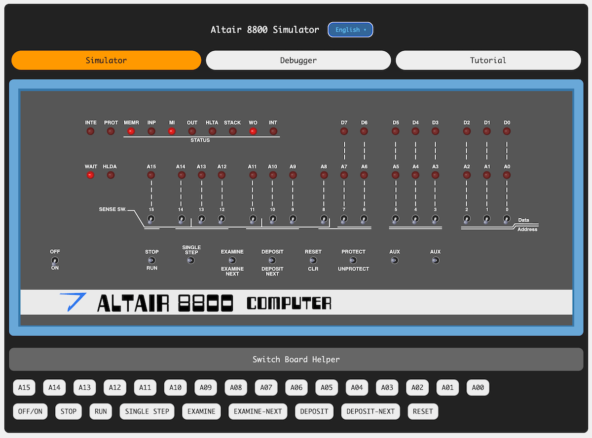
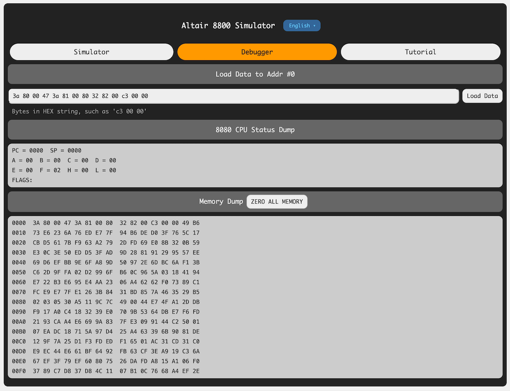
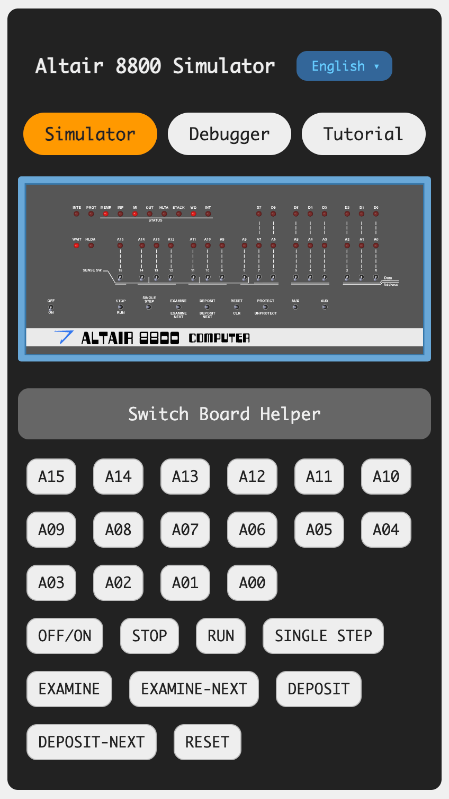

# Altair 8800 simulator.

[](https://github.com/wixette/8800-simulator/actions/workflows/test.yml)

A JavaScript simulator to demonstrate the front panel operations of Altair 8800.

## Usage

Simply open index.html in browser, or copy the entire dir to your web server's root dir.

The simulator UI supports English and Chinese for now. In a desktop browser, you may use mouse to toggle or click the switches on the panel directly.



There is a Debugger tab where you can check the internal status of the simulated 8080 CPU, or the contents of the simulator's memory.



There is a Teletype tab holding a simulated ASR-33: the paper, its keyboard, and a repeat of the address and data LEDs so a program that prints and lights lamps at once can be watched on one screen. The machine talks to it through an 88-SIO serial board on ports 00H and 01H, so a program has to be running and reading that board before anything appears — nothing echoes by itself. Load [tty-echo](./examples/tty-echo.asm) and RUN it, then type.

[tty-leds](./examples/tty-leds.asm) is the one to start with: eighteen bytes, and pressing A lights `01000001` on the data LEDs while printing the letter on the paper.

For something to actually play, [guess-letter](./examples/guess-letter.asm) is a game in 218 bytes — it thinks of a letter and tells you whether yours is higher or lower, and counts your guesses. Twenty-six letters fall to five tries if you halve the alphabet each time.

```
GUESS MY LETTER A-Z. ANY KEY STARTS.

? M HIGHER
? T HIGHER
? W LOWER
? U HIGHER
? V GOT IT IN 5 TRIES.
```

The Debugger tab lists every program in [examples/](./examples/) under *Load a Program*. Pick one and it is loaded at 0000H with RESET pressed, ready to RUN — the menu reads the listing files themselves, so there is no assembled copy of a program anywhere to fall out of step with its source. *Load Your Own* below it takes a hex string or a binary file from disk.

The Debugger tab is also where you choose how much memory is installed: 256 bytes as the Altair 8800 shipped, or 4 KB / 8 KB as if you had plugged in one or two 88-4MCS static memory boards. Memory boards are not something you add to a running machine, so changing the size switches the simulator off.

## Microsoft BASIC

The simulator runs the Altair's first piece of software, and Microsoft's: [Altair BASIC 3.2](http://altairbasic.org), written in 1975 by Bill Gates, Paul Allen and Monte Davidoff. Choose 4 KB or 8 KB of memory in the Debugger tab, click LOAD 4K BASIC, then RUN from the front panel and type at the Teletype tab.

```
MEMORY SIZE?
TERMINAL WIDTH?
WANT SIN? Y

727 BYTES FREE

BASIC VERSION 3.2
[4K VERSION]

OK
```

On a 4 KB machine that leaves 727 bytes for your program, which is exactly what the name means — load it and look at the memory map before pressing RUN, and you can see BASIC filling fifteen of the machine's sixteen pages. The Tutorial tab walks through it, including what the LOAD button quietly skips: toggling in a 28 byte boot loader by hand and then waiting seven minutes for the paper tape.

The ROM is in [roms/](./roms/), and [roms/NOTICE](./roms/NOTICE) explains what it is and why it is not under this repository's licence. It is optional; LOAD BINARY FILE will load an image of your own instead.

Above 256 bytes the memory dump shows one 256-byte window at a time rather than the whole machine, with a map strip above it — one cell per page, shaded by how much of that page is in use, and marked where the program counter and the stack pointer are. Click a cell to jump the window there, or use FOLLOW PC to let it track the running program.

The simulator works fine with modern mobile browsers, except that it is a bit challenging to touch a single switch on the panel on a mobile screen. Although, the helper switch buttons below the panel can be used as an alternative solution.



## A Quick Tutorial

With a running Altair 8800 simulator, how to input and run the following program to calculate 1 + 2 = 3:

```
        LDA 0080H  ; 00 111 010
                   ; 10 000 000
                   ; 00 000 000
        MOV B,A    ; 01 000 111
        LDA 0081H  ; 00 111 010
                   ; 10 000 001
                   ; 00 000 000
        ADD B      ; 10 000 000
        STA 0082H  ; 00 110 010
                   ; 10 000 010
                   ; 00 000 000
        JMP 0000H  ; 11 000 011
                   ; 00 000 000
                   ; 00 000 000
```

 1. Turn on Altair 8800 by clicking OFF/ON switch.
 1. Set switches A7-A0 to 00 111 010 (up for 1, down for 0).
 1. Click "DEPOSIT".
 1. Set switches A7-A0 to 10 000 000.
 1. Click "DEPOSIT NEXT".
 1. Repeat step 4-5 to input the following bytes one by one: 00 000 000, 01 000 111, 00 111 010, 10 000 001, 00 000 000, 10 000 000, 00 110 010, 10 000 010, 00 000 000, 11 000 011, 00 000 000, 00 000 000.
 1. Set switches A7-A0 to 10 000 000.
 1. Click "EXAMINE".
 1. Set switches A7-A0 to 00 000 001 (the first number to be added, or 1 in decimal).
 1. Click "DEPOSIT".
 1. Set switches A7-A0 to 00 000 010 (the second number to be added, or 2 in decimal).
 1. Click "DEPOSIT NEXT".
 1. Click "RESET".
 1. Click "RUN" and wait for a few seconds.
 1. Click "STOP".
 1. Set switches A7-A0 to 10 000 010 (the address that holds the sum).
 1. Click "EXAMINE".
 1. The LEDs D7-D0 show the result 00 000 011 (3 in decimal).
 1. Turn off Altair 8800.

## Example programs

Small 8080 programs to try on the simulator, from a two instruction
I/O echo to the 1975 game *Kill the Bit*, are in
[examples/](examples/), each with a listing and instructions for
loading it. They double as the golden set the tests run against.

## Tests

```
npm test
```

Node.js 24, no dependencies to install. The suite covers the 8080 CPU,
the front panel, and every program in [examples/](examples/), and runs
on each push and pull request.

## References

- [Wikipedia: Altair 8800](https://en.wikipedia.org/wiki/Altair_8800)
- [Wikipedia: Intel 8080 CPU](https://en.wikipedia.org/wiki/Intel_8080)
- [Intel 8080 instruction set - an opcode encoding quick reference (text)](http://www.classiccmp.org/dunfield/r/8080.txt)
- [Original Altair 8800 manuals - scanned PDFs archived at altairclone.com](https://altairclone.com/altair_manuals.html)
- [Altair 8800 Operator's Manual - the original manual as a scanned PDF](https://altairclone.com/downloads/manuals/Altair%208800%20Operator's%20Manual.pdf)
- [Altair 8800 Operator's Manual v2.0 - an HTML edition by Kevin Cole](https://ubuntourist.codeberg.page/Altair-8800/)
- [Intel 8080 Assembly Language Programming Manual - Intel's original manual as a scanned PDF](http://www.classiccmp.org/dunfield/r/8080asm.pdf)
- [Demystifying Computers - an open source book by Chris Jones and Jeff Elkner](https://www.openbookproject.net/books/demystcomp/index.html)
- [MITS Altair Simulator - another JavaScript simulator, running Microsoft BASIC on a simulated teletype](https://s2js.com/altair/)

## Acknowledgements

I use https://github.com/maly/8080js to execute Intel 8080 instruments.

The Quick Tutoral in the simulator UI refers to an example program got from the original [Altair 8800 Operator's Manual](https://altairclone.com/downloads/manuals/Altair%208800%20Operator's%20Manual.pdf).

The interaction design took [another Altair 8800 simulator](https://s2js.com/altair/) as a reference.
