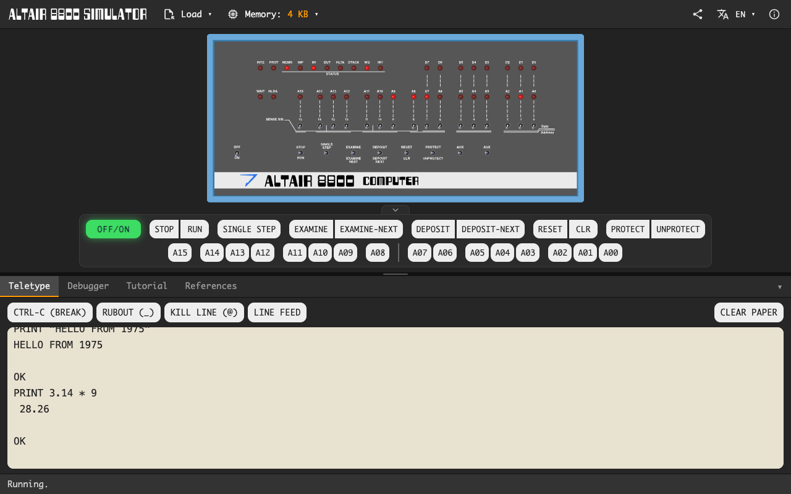
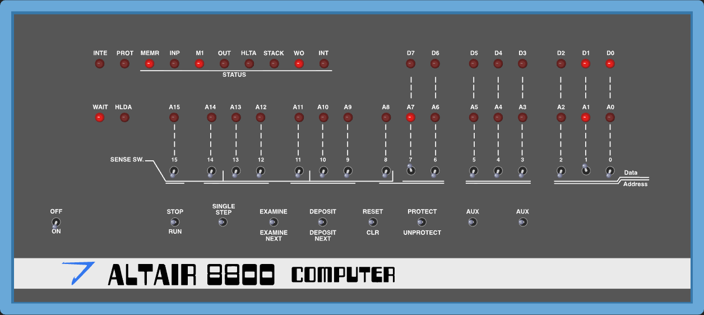

# Altair 8800 Simulator

[](https://github.com/wixette/8800-simulator/actions/workflows/test.yml)

The 1975 computer that started the personal computer revolution, in
your browser. Toggle 8080 machine code in through a working front
panel, watch it run on the lamps, then install a memory board and boot
Microsoft's original 4K BASIC on a simulated Teletype.

**[▶ Try it online](https://wixette.github.io/8800-simulator/)**, with
nothing to install.



**The route through it:**
[1. Try it](#1-try-it-in-a-minute) →
[2. The front panel](#2-meet-the-front-panel) →
[3. A program by hand](#3-your-first-program-by-hand) →
[4. Around the simulator](#4-around-the-simulator) →
[5. The Teletype](#5-the-teletype) →
[6. 4K BASIC](#6-microsoft-4k-basic) →
[7. More programs](#7-more-programs) →
[8. For developers](#8-for-developers)

## 1. Try it in a minute

1. Open the simulator, [online](https://wixette.github.io/8800-simulator/)
   or [on your own machine](#run-it-locally).
2. Open **Load**, and choose **Pattern shift** under *Front Panel
   Examples*.
3. Click **RUN**, on the strip of buttons under the panel or on the
   panel's own RUN switch.

A pattern now walks across the data lamps, D7–D0. That is a real
program: eight bytes of 8080 machine code, running at the Altair's
own 2 MHz. Click **STOP** to stop it.

## 2. Meet the front panel

The Altair 8800 had no screen and no keyboard. This panel was the
whole of the way in and out.



**The lamps** show the machine as it is:

| Lamps | Show |
| --- | --- |
| A15–A0 | The address bus: the memory address the CPU is at |
| D7–D0 | The data bus: the byte at that address |
| STATUS, WAIT | What the CPU is doing. WAIT is lit while it is stopped, and HLTA too when a HLT stopped it |
| INTE | Interrupts are enabled: lit by EI, put out by DI and RESET |
| PROT | The memory board at the address shown is protected |

**The switches** are how you talk to it:

| Switch | What it does |
| --- | --- |
| OFF/ON | Power. Memory comes up full of random bytes, as on the real one |
| A15–A0 | An address, up for 1 and down for 0. A7–A0 is also the byte to store. Programs can read A15–A8 as the *sense switches* |
| EXAMINE · EXAMINE NEXT | Show the byte at the address on the switches · at the next address |
| DEPOSIT · DEPOSIT NEXT | Store A7–A0 at the address shown · at the next address |
| RESET · CLR | Send the CPU back to 0000H · clear the serial boards, dropping keys typed and not yet read |
| RUN · STOP | Run the program from where the CPU is · stop it |
| SINGLE STEP | Run one instruction |
| PROTECT · UNPROTECT | Protect the memory board at the address shown (EXAMINE an address on it first), so that neither DEPOSIT nor a program can change it · unprotect it. Each 4 KB board has its own; everything starts unprotected |
| AUX | Nothing: MITS left both spare, for boards added later |

The switches come in groups of three because 8080 programmers wrote
bytes in octal: `00 111 010` is 072 octal, or 3AH. Click the panel's
own switches, or the large buttons on the strip under it, which are
easier to hit and show which switches are up. The small arrow on the
strip's top edge folds it away.

**One simplification.** SINGLE STEP here always runs one whole
instruction, as the Altair's Operator's Manual describes it. The
circuit itself, MITS's *Theory of Operation* says, stopped after each
machine cycle, so one instruction could take up to five presses.
Stopping only between instructions keeps a step about the program
rather than the bus. It also means the STATUS lamps always show the
CPU about to fetch its next instruction - MEMR, M1 and WO - or, after
a HLT, MEMR, HLTA and WO. INP, OUT and STACK belong to cycles inside
an instruction, so they stay dark; and while a program runs the lamps
hold still, rather than glowing with every cycle as the real ones did.

## 3. Your first program, by hand

This is how an Altair owner put in a program in 1975: one byte at a
time, on the switches. It adds 1 and 2. The same steps are in the
simulator's **Tutorial**, under the panel, to follow as you go.

```
        LDA 0080H  ; 00 111 010
                   ; 10 000 000
                   ; 00 000 000
        MOV B,A    ; 01 000 111
        LDA 0081H  ; 00 111 010
                   ; 10 000 001
                   ; 00 000 000
        ADD B      ; 10 000 000
        STA 0082H  ; 00 110 010
                   ; 10 000 010
                   ; 00 000 000
        JMP 0000H  ; 11 000 011
                   ; 00 000 000
                   ; 00 000 000
```

 1. Turn on Altair 8800 by clicking OFF/ON switch.
 1. Set switches A7-A0 to 00 111 010 (up for 1, down for 0).
 1. Click "DEPOSIT".
 1. Set switches A7-A0 to 10 000 000.
 1. Click "DEPOSIT NEXT".
 1. Repeat step 4-5 to input the following bytes one by one: 00 000 000, 01 000 111, 00 111 010, 10 000 001, 00 000 000, 10 000 000, 00 110 010, 10 000 010, 00 000 000, 11 000 011, 00 000 000, 00 000 000.
 1. Set switches A7-A0 to 10 000 000.
 1. Click "EXAMINE".
 1. Set switches A7-A0 to 00 000 001 (the first number to be added, or 1 in decimal).
 1. Click "DEPOSIT".
 1. Set switches A7-A0 to 00 000 010 (the second number to be added, or 2 in decimal).
 1. Click "DEPOSIT NEXT".
 1. Click "RESET".
 1. Click "RUN" and wait for a few seconds.
 1. Click "STOP".
 1. Set switches A7-A0 to 10 000 010 (the address that holds the sum).
 1. Click "EXAMINE".
 1. The LEDs D7-D0 show the result 00 000 011 (3 in decimal).
 1. Turn off Altair 8800.

At step 18 the panel looks like the picture in
[section 2](#2-meet-the-front-panel): A7 and A1 lit for the address
0082H, and D1 and D0 for the answer.

## 4. Around the simulator

Everything is on one screen: the panel, a toolbar above it, a dock of
tools below it, and a status line along the foot.

- **The toolbar.** *Load* puts a program in. *Memory* installs 256
  bytes, as the Altair shipped, or 4 KB or 8 KB, as if you had fitted
  one or two 88-4MCS boards. Fitting a board meant opening the case, so
  this switches the machine off. On the right are *Share*, the
  language (ten of them), and *About*.
- **The dock** holds five tabs, one at a time: the **Teletype**, the
  **Assembler**, the **Debugger**, the **Tutorial**, and the
  **References** (the source code and further reading). On a phone the
  tabs are icons. Click a tab to open it, click it
  again (or ▾) to fold the dock away, and drag the handle above it to
  share the height with the panel. Whatever you load, the dock opens
  on the Debugger to show it arriving.
- **The status line** says what just happened, and why a greyed-out
  control is greyed out.

The **Debugger** is a view the real Altair never had. Step through a
program with SINGLE STEP and watch it work:


- **The registers**, with the flags S Z AC P CY lit when set.
- **The next instruction**: its address, its bytes, its mnemonic with
  the operand named as instruction tables name it (`LDA a16`,
  `MVI B,d8`), and the operand's value this time.
- **The memory dump**, one 256-byte page at a time, with the
  instruction at the program counter marked. With more than 256 bytes
  installed, a map strip above it shows every page, shaded by how full
  it is. Click a page to see it, or use **Follow PC**.
- **Changing a byte**: with the machine stopped, click a byte in the
  dump and type two hex digits. The byte changes and the next one is
  picked, so `3e8cd3ff` fills four in a row; the arrow keys move, and
  Esc stops. A protected board refuses, as it refuses DEPOSIT.

## 5. The Teletype

The Altair's terminal was a Teletype ASR-33: a keyboard and a printer
on paper, upper case only. Here it sits on an 88-SIO serial board, at
ports 00H and 01H (and an 88-2SIO at 10H and 11H). Nothing echoes by
itself: a program has to be running and reading the board.


Try the *Teletype Examples* from the Load menu, in this order:

1. **Teletype hello** prints `HELLO, WORLD!` and stops.
2. **Teletype echo** prints whatever you type.
3. **Teletype echo with LEDs** does the same, and shows each key's
   ASCII code on the data lamps: press A and `01000001` lights up.
4. **Guess my letter** is a game. It thinks of a letter and says
   HIGHER or LOWER. Halve the alphabet each time and 26 letters fall to
   five tries.

The keys a PC keyboard lacks, such as BREAK, RUBOUT and LINE FEED, are
along the top of the paper.

## 6. Microsoft 4K BASIC

The Altair's first piece of software was Microsoft's first product:
[Altair BASIC 3.2](http://altairbasic.org), written in 1975 by Bill
Gates, Paul Allen and Monte Davidoff. It runs here, unmodified.

1. In **Memory**, choose 4 KB (or 8 KB, for more room).
2. In **Load**, choose **Microsoft 4K BASIC**.
3. Click **RUN**, and open the **Teletype**.
4. Answer BASIC's questions: Enter, Enter, then Y.

```
MEMORY SIZE?
TERMINAL WIDTH?
WANT SIN? Y

727 BYTES FREE

BASIC VERSION 3.2
[4K VERSION]

OK
PRINT 3.14 * 9
 28.26

OK
```

727 bytes is all a 4 KB machine leaves you, which is exactly what the
name means. Load it and look at the memory map in the Debugger before
pressing RUN, and you can see BASIC filling fifteen of the sixteen
pages. The Tutorial walks through it, including what loading it here
skips: toggling in a 28 byte boot loader by hand, then waiting seven
minutes for the paper tape.

The BASIC tape is in [roms/](./roms/), and [roms/NOTICE](./roms/NOTICE)
explains what it is and why it is not under this repository's licence.
**Binary File…** in the Load menu loads an image of your own instead.

## 7. More programs

- **[Kill the Bit](examples/kill-the-bit.md)**, the 1975 front-panel
  game by Dean McDaniel: a lit bit runs across the upper address lamps,
  and you kill it by flipping the sense switch under it at the right
  moment.
- **Ten example programs** in all, each a listing with its bytes and
  its source: see [examples/](examples/README.md).
- **Your own, in assembly language**: the **Assembler** tab takes the
  language of Intel's 1975 *8080 Assembly Language Programming
  Manual*, macros and all. Write a program, or start from one of its
  **Examples** ([examples/source/](examples/source/README.md)); the
  listing beside the source shows each line's address and bytes as you
  type, errors are marked on their lines, and **Assemble** (Ctrl+Enter)
  puts the program into memory, ready to RUN.
- **Your own, as bytes**: paste them in hex with **Load › Hex Bytes…**,
  or read a binary with **Load › Binary File…**.
- **Share one as a link**: **Share** copies a link that opens the
  simulator with your program loaded, or with the whole machine as it
  is now. A link can be written by hand too, and put in a document
  next to the program's listing, like this one, which lights 10001100
  on the data lamps and halts:
  **[Run it](https://wixette.github.io/8800-simulator/?hex=3E8CD3FF76)**.

## 8. For developers

### Run it locally

Serve the directory over HTTP and open it. With no web server
installed, Python has one built in:

```
python3 -m http.server 8000
```

Then open <http://localhost:8000/>. To deploy, copy the whole
directory to a web server; there is nothing to build, and no
dependencies.

Opening `index.html` straight off the disk mostly works, but a browser
will not let a `file://` page read the files beside it. So the example
programs and the BASIC tape, which the page reads from `examples/` and
`roms/`, grey out and say why.

### How it is built

| File | What it is |
| --- | --- |
| [index.html](index.html), [css/style.css](css/style.css) | The page: toolbar, panel, dock, dialogs |
| [js/8080.js](js/8080.js) | The Intel 8080 CPU core, [maly/8080js](https://github.com/maly/8080js) |
| [js/sim8800.js](js/sim8800.js) | The machine: memory, the front panel's logic, the ports |
| [js/sio.js](js/sio.js), [js/teletype.js](js/teletype.js) | The serial boards, and the Teletype's paper |
| [js/panel.js](js/panel.js) | The page's own logic: panel drawing, menus, dock, debugger |
| [js/link.js](js/link.js) | The program link format |
| [js/asm8080.js](js/asm8080.js), [js/asmtab.js](js/asmtab.js) | The 8080 assembler, and its tab |
| [js/listing.js](js/listing.js) | Reads the example listings |
| [js/dropdown.js](js/dropdown.js), [js/dialog.js](js/dialog.js) | The menus and the dialogs |
| [js/l10n.js](js/l10n.js) | Every message, in ten languages |

The design notes say why things are the way they are:
[docs/ui-design.md](docs/ui-design.md) for the layout and its
principles, [docs/ms-basic-4k.md](docs/ms-basic-4k.md) for the
memory, the serial boards, the Teletype and BASIC,
[docs/assembler.md](docs/assembler.md) for the assembler and the
language it takes, and [docs/kill-the-bit.md](docs/kill-the-bit.md)
for the address-bus trick Kill the Bit relies on.

### Tests

```
npm test
```

Node.js 24, nothing to install. The suite covers the 8080 CPU, the
front panel, the serial boards and the Teletype, the page's own logic
and translations, the link format, the assembler against Intel's
manual, every program in [examples/](examples/), and 4K BASIC booting
and running end to end. It
runs on each push and pull request.

### The link format

A link opens the simulator with a program loaded at 0000H, ready to
RUN. The fields go after `?` or `#`:

```
https://wixette.github.io/8800-simulator/?hex=3E8CD3FF76
```

[Try it](https://wixette.github.io/8800-simulator/?hex=3E8CD3FF76):
the bytes are `MVI A,8CH`, `OUT 0FFH` and `HLT`. Click RUN and the
data lamps show 10001100.

The bytes of `hex` can run together, or be separated by `+` or `%20`.
Memory is installed to fit, and zeros at the end do not count.

**Share** writes its links after `#`, which is never sent to the web
server, so a long one is not turned away (GitHub Pages refuses a link
of 16,000 characters). It leaves out whatever a machine just switched
on would have anyway. Memory in use that fits in 256 bytes is written
as hex, so it can be read in the link; past that it is compressed under
`zip`, and 4K BASIC comes to about 4,500 characters instead of 8,300.
Every field is optional:

| Field | Holds |
|---|---|
| `hex` | Memory from 0000H up, in hex |
| `zip` | The same memory, deflated and in URL-safe base64, in place of `hex` |
| `mem` | Installed memory: `256`, `4096` or `8192` (decimal) |
| `pc`, `sp` | The 16-bit registers, in hex |
| `a`, `b`, `c`, `d`, `e`, `h`, `l`, `f` | The 8-bit registers, in hex, `f` being the flags |
| `sw` | The address switches, A15-A0, as a 16-bit hex word |

A linked machine always opens stopped. The Teletype's paper and the
interrupt enable are not in the link. The format is a promise to
everyone who has put a link in a document: fields may be added, but
never renamed or read differently ([js/link.js](js/link.js)).

## References

- [Wikipedia: Altair 8800](https://en.wikipedia.org/wiki/Altair_8800)
- [Wikipedia: Intel 8080 CPU](https://en.wikipedia.org/wiki/Intel_8080)
- [Intel 8080 instruction set - an opcode encoding quick reference (text)](http://www.classiccmp.org/dunfield/r/8080.txt)
- [Original Altair 8800 manuals - scanned PDFs archived at altairclone.com](https://altairclone.com/altair_manuals.html)
- [Altair 8800 Operator's Manual - the original manual as a scanned PDF](https://altairclone.com/downloads/manuals/Altair%208800%20Operator's%20Manual.pdf)
- [Altair 8800 Operator's Manual v2.0 - an HTML edition by Kevin Cole](https://ubuntourist.codeberg.page/Altair-8800/)
- [Intel 8080 Assembly Language Programming Manual - Intel's original manual as a scanned PDF](http://www.classiccmp.org/dunfield/r/8080asm.pdf)
- [Demystifying Computers - an open source book by Chris Jones and Jeff Elkner](https://www.openbookproject.net/books/demystcomp/index.html)
- [Wikipedia: Altair BASIC - what it is, and how Microsoft started with it](https://en.wikipedia.org/wiki/Altair_BASIC)
- [MITS Altair BASIC Reference Manual (1975) - the language itself, the startup questions and the error codes](https://altairclone.com/downloads/manuals/BASIC%20Manual%2075.pdf)
- [Altair BASIC 3.2 (4K) - an annotated disassembly of the exact program this simulator runs](http://altairbasic.org)
- [MITS Altair Simulator - another JavaScript simulator, running Microsoft BASIC on a simulated teletype](https://s2js.com/altair/)

## Acknowledgements

The Intel 8080 CPU core is [maly/8080js](https://github.com/maly/8080js).

The Quick Tutorial in the simulator uses an example program from the original [Altair 8800 Operator's Manual](https://altairclone.com/downloads/manuals/Altair%208800%20Operator's%20Manual.pdf).

The interaction design took [another Altair 8800 simulator](https://s2js.com/altair/) as a reference.
