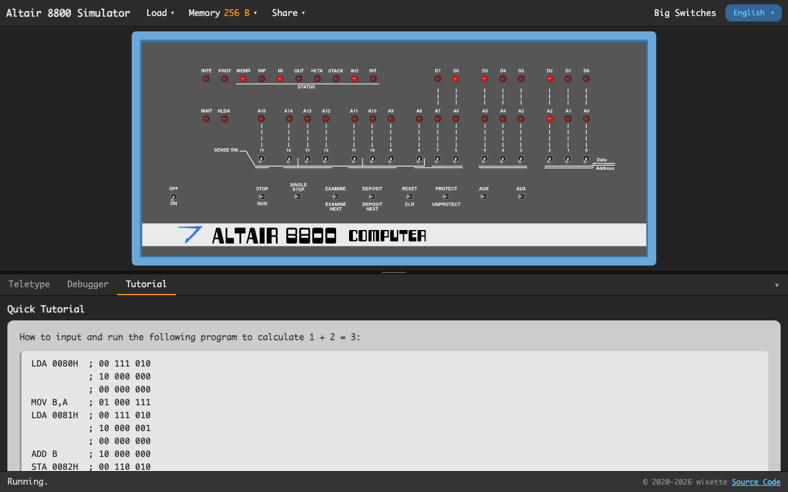
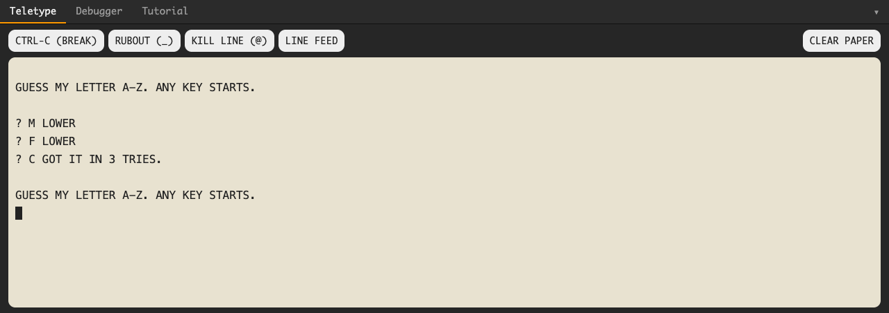
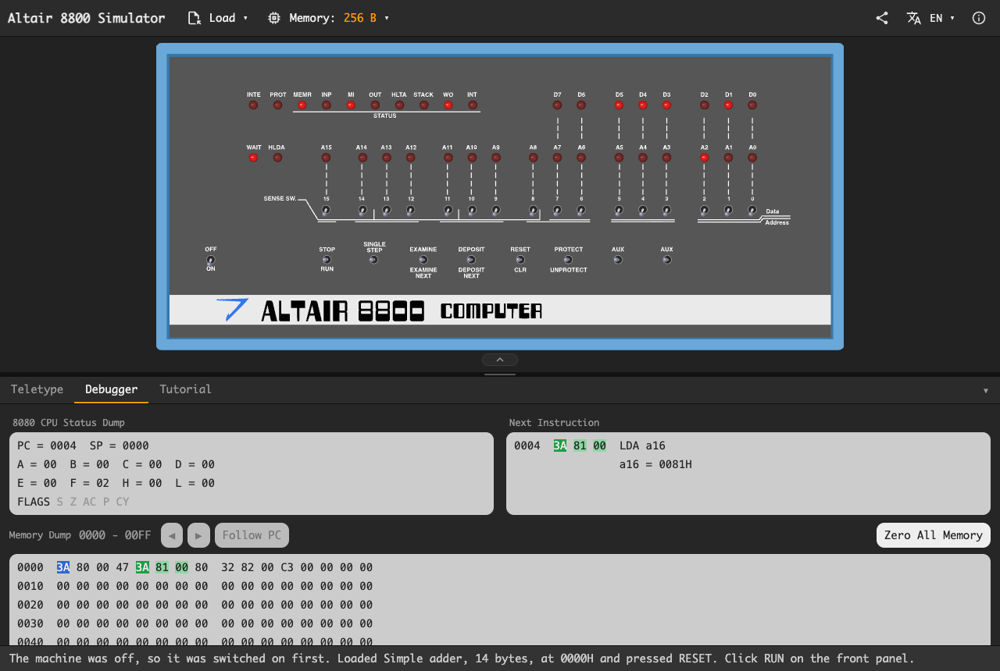

# Altair 8800 Simulator

[](https://github.com/wixette/8800-simulator/actions/workflows/test.yml)

The 1975 computer that started the personal computer revolution, in
your browser. Toggle 8080 machine code in through a working front
panel, watch it run on the LEDs, then install a memory board and boot
Microsoft's original 4K BASIC on a simulated Teletype.

**[Try it online](https://wixette.github.io/8800-simulator/)**

- **A working front panel.** The Altair 8800's address and data lamps
  and its switches - EXAMINE, DEPOSIT, SINGLE STEP, RUN, RESET and the
  sense switches - on an Intel 8080 clocked at the machine's own 2 MHz.
- **Microsoft Altair BASIC 3.2.** The 4K edition Bill Gates, Paul Allen
  and Monte Davidoff wrote in 1975, running unmodified.
- **The hardware it needs.** A Teletype ASR-33 on MITS 88-SIO and
  88-2SIO serial boards, and 256 B, 4 KB or 8 KB of memory, installed
  the way you installed a board.
- **A debugger the Altair never had.** Live CPU registers, a paged
  memory dump, and a map of what fills each page of memory.
- **Ten example programs**, from a seven byte switch echo to a guessing
  game on the teletype, each a checked listing you load with one click.
- **Nine languages**, no build step and no dependencies.



## Usage

Serve the directory over HTTP and open it. Anything will do; with no
web server installed, Python has one built in:

```
python3 -m http.server 8000
```

then open <http://localhost:8000/>. To deploy, copy the whole directory
to your web server's root — there is nothing to build.

Opening `index.html` straight off the disk mostly works: the front
panel, the teletype and the debugger are all in the page itself. Two
things are not — the example programs and the 4K BASIC tape, which the
page reads from `examples/` and `roms/` when you ask for them. A
browser treats every `file://` page as a different site from the files
beside it and blocks the read, so those two controls grey out and say
so. Serving the directory is what fixes it.

The simulator is one screen: the front panel, with a dock of tools
under it, a toolbar above and a status line along the foot.

**The front panel** is always in view, and grows or shrinks to fill
whatever room the dock leaves. In a desktop browser you click its
switches directly. Under it sits the *Switch Board Helper*: the same
switches as large buttons, laid out as the panel lays them out, which
show which switches are up and are much easier to hit on a phone. The
small arrow on its top edge folds it away, and brings it back.

The toolbar has what you do to the machine on the left, and what you do
with the app on the right. **Load** is how programs get in:

- **Hex Bytes…** opens a box to paste or type bytes in hex, and
  **Binary File…** reads one from disk.
- **Microsoft 4K BASIC**, which needs 4 KB or more installed, and says
  so in the menu until it has it.
- **Front Panel Examples** and **Teletype Examples**: every program in
  [examples/](./examples/), grouped by where its output appears. Pick
  one and it is loaded at 0000H with RESET pressed, ready to RUN. The
  menu reads the listing files themselves, so there is no assembled
  copy of a program anywhere to fall out of step with its source.

Whatever is loaded, the dock opens on the Debugger to show it arriving.
**Memory** chooses 256 bytes, as the Altair 8800 shipped, or 4 KB /
8 KB as if you had plugged in one or two 88-4MCS memory boards. Memory
boards are not something you add to a running machine, so changing the
size switches the simulator off.

On the right, the share icon opens **Share a Link**: a link to the
program at RESET, ready to RUN, or to the machine as it is now, stopped
where it is with its registers and switches (see
[Linking to a program](#linking-to-a-program)). The language icon
switches between nine languages, and the ⓘ opens **About**: the
version, the source code and how to report a problem, and the licences.

The dock holds three tools, one at a time. Click a tab to open it;
click the open tab again, or ▾, to fold the dock away; drag the handle
above it to share the height between the dock and the panel. The page
remembers how you left it.

**Teletype** is a simulated ASR-33: the paper, and its keyboard, with
the keys a PC keyboard lacks along the top. The machine talks to it
through an 88-SIO serial board on ports 00H and 01H (and an 88-2SIO on
10H and 11H), so a program has to be running and reading that board
before anything appears — nothing echoes by itself, and the empty paper
says so. A dot on the tab says when something has printed while you
were looking at another tool.



**Debugger** shows the internal state of the simulated 8080 CPU and
the contents of memory:

- The **registers**, with the flags S Z AC P CY lit when set, and
  beside them the **next instruction**: its address, its bytes, and its
  mnemonic with the operand named as instruction tables name it
  (`LHLD a16`, `MVI B,d8`), then the operand's value this time. Step
  with SINGLE STEP on the panel above and watch it change.
- The **memory dump** shows one 256-byte page at a time, with the
  instruction at the program counter marked: its opcode in green and
  the bytes that belong to it in a paler green. Above 256 bytes a map
  strip sits over it — one cell per page, shaded by how much of that
  page is in use, and marked where the program counter and the stack
  pointer are. Click a cell to jump there, or use **Follow PC** to
  track the running program.



**Tutorial** walks through toggling in a first program by hand and
starting BASIC, with references for going further. It sits under the
panel it is about, so you can follow it step by step.

### Linking to a program

A link can open the simulator with a program already loaded at 0000H,
ready to RUN. Put the bytes after `?hex=`:

```
https://wixette.github.io/8800-simulator/?hex=3E8CD3FF76
```

The bytes can run together, or be separated by `+` or `%20`. Memory is
installed to fit: 256 bytes unless the program needs more, and zeros
at the end do not count. Such a link can go in a Markdown file next to
the program's listing:

```markdown
[Run it](https://wixette.github.io/8800-simulator/?hex=3E8CD3FF76)
```

A link can use `#` in place of `?`, as in `#hex=3E8CD3FF76`; both
work.

**Share a Link** writes a link after `#`. Linking to the machine as it
is now also holds the registers and the machine's place in the
program. It leaves out whatever a
machine just switched on would have anyway: registers that are zero
(or `02` for `f`), switches that are all down, and `mem` when the
program needs no more than that. When
the memory in use fits in 256 bytes it is written as hex, to be read in
the link. Past that it is compressed and written under `zip` instead:
4K BASIC comes to about 4,500 characters rather than 8,300. Being after
`#`, none of it is sent to the web server, whose limit on a link's
length (GitHub Pages refuses one of 16,000 characters) would otherwise
turn a large machine away. Every field is optional:

| Field | Holds |
|---|---|
| `hex` | Memory from 0000H up, in hex |
| `zip` | The same memory, deflated and in URL-safe base64, in place of `hex` |
| `mem` | Installed memory: `256`, `4096` or `8192` (decimal) |
| `pc`, `sp` | The 16-bit registers, in hex |
| `a`, `b`, `c`, `d`, `e`, `h`, `l`, `f` | The 8-bit registers, in hex, `f` being the flags |
| `sw` | The address switches, A15-A0, as a 16-bit hex word |

A linked machine always opens stopped. The teletype's paper and the
interrupt enable are not in the link.

## Teletype programs

[tty-leds](./examples/tty-leds.asm) is the one to start with: eighteen bytes, and pressing A lights `01000001` on the data LEDs while printing the letter on the paper.

For something to actually play, [guess-letter](./examples/guess-letter.asm) is a game in 218 bytes — it thinks of a letter and tells you whether yours is higher or lower, and counts your guesses. Twenty-six letters fall to five tries if you halve the alphabet each time.

```
GUESS MY LETTER A-Z. ANY KEY STARTS.

? M HIGHER
? T HIGHER
? W LOWER
? U HIGHER
? V GOT IT IN 5 TRIES.
```

## Microsoft BASIC

The simulator runs the Altair's first piece of software, and Microsoft's: [Altair BASIC 3.2](http://altairbasic.org), written in 1975 by Bill Gates, Paul Allen and Monte Davidoff. Choose 4 KB or 8 KB from the **Memory** menu, then **Load 4K BASIC** from the **Load** menu, then RUN from the front panel and type at the Teletype.

```
MEMORY SIZE?
TERMINAL WIDTH?
WANT SIN? Y

727 BYTES FREE

BASIC VERSION 3.2
[4K VERSION]

OK
```

On a 4 KB machine that leaves 727 bytes for your program, which is exactly what the name means — load it and look at the memory map before pressing RUN, and you can see BASIC filling fifteen of the machine's sixteen pages. The Tutorial walks through it, including what Load 4K BASIC quietly skips: toggling in a 28 byte boot loader by hand and then waiting seven minutes for the paper tape.

The ROM is in [roms/](./roms/), and [roms/NOTICE](./roms/NOTICE) explains what it is and why it is not under this repository's licence. It is optional; **Load Binary File** will load an image of your own instead.

## A Quick Tutorial

How to input and run the following program to calculate 1 + 2 = 3, by hand, on the front panel. The same steps are in the simulator's Tutorial.

```
        LDA 0080H  ; 00 111 010
                   ; 10 000 000
                   ; 00 000 000
        MOV B,A    ; 01 000 111
        LDA 0081H  ; 00 111 010
                   ; 10 000 001
                   ; 00 000 000
        ADD B      ; 10 000 000
        STA 0082H  ; 00 110 010
                   ; 10 000 010
                   ; 00 000 000
        JMP 0000H  ; 11 000 011
                   ; 00 000 000
                   ; 00 000 000
```

 1. Turn on Altair 8800 by clicking OFF/ON switch.
 1. Set switches A7-A0 to 00 111 010 (up for 1, down for 0).
 1. Click "DEPOSIT".
 1. Set switches A7-A0 to 10 000 000.
 1. Click "DEPOSIT NEXT".
 1. Repeat step 4-5 to input the following bytes one by one: 00 000 000, 01 000 111, 00 111 010, 10 000 001, 00 000 000, 10 000 000, 00 110 010, 10 000 010, 00 000 000, 11 000 011, 00 000 000, 00 000 000.
 1. Set switches A7-A0 to 10 000 000.
 1. Click "EXAMINE".
 1. Set switches A7-A0 to 00 000 001 (the first number to be added, or 1 in decimal).
 1. Click "DEPOSIT".
 1. Set switches A7-A0 to 00 000 010 (the second number to be added, or 2 in decimal).
 1. Click "DEPOSIT NEXT".
 1. Click "RESET".
 1. Click "RUN" and wait for a few seconds.
 1. Click "STOP".
 1. Set switches A7-A0 to 10 000 010 (the address that holds the sum).
 1. Click "EXAMINE".
 1. The LEDs D7-D0 show the result 00 000 011 (3 in decimal).
 1. Turn off Altair 8800.

## Example programs

Ten small 8080 programs to try on the simulator — five on the front
panel, from a pattern walking across the LEDs to the 1975 game *Kill
the Bit*, and five on the teletype, from `HELLO, WORLD!` to a guessing
game — are in [examples/](examples/), each with a listing and
instructions for loading it. They double as the golden set the tests
run against.

## Tests

```
npm test
```

Node.js 24, no dependencies to install. The suite covers the 8080 CPU,
the front panel, the serial boards and the teletype, the page's own
logic and translations, every program in [examples/](examples/), and
4K BASIC booting and running end to end. It runs on each push and pull
request.

## References

- [Wikipedia: Altair 8800](https://en.wikipedia.org/wiki/Altair_8800)
- [Wikipedia: Intel 8080 CPU](https://en.wikipedia.org/wiki/Intel_8080)
- [Intel 8080 instruction set - an opcode encoding quick reference (text)](http://www.classiccmp.org/dunfield/r/8080.txt)
- [Original Altair 8800 manuals - scanned PDFs archived at altairclone.com](https://altairclone.com/altair_manuals.html)
- [Altair 8800 Operator's Manual - the original manual as a scanned PDF](https://altairclone.com/downloads/manuals/Altair%208800%20Operator's%20Manual.pdf)
- [Altair 8800 Operator's Manual v2.0 - an HTML edition by Kevin Cole](https://ubuntourist.codeberg.page/Altair-8800/)
- [Intel 8080 Assembly Language Programming Manual - Intel's original manual as a scanned PDF](http://www.classiccmp.org/dunfield/r/8080asm.pdf)
- [Demystifying Computers - an open source book by Chris Jones and Jeff Elkner](https://www.openbookproject.net/books/demystcomp/index.html)
- [Wikipedia: Altair BASIC - what it is, and how Microsoft started with it](https://en.wikipedia.org/wiki/Altair_BASIC)
- [MITS Altair BASIC Reference Manual (1975) - the language itself, the startup questions and the error codes](https://altairclone.com/downloads/manuals/BASIC%20Manual%2075.pdf)
- [Altair BASIC 3.2 (4K) - an annotated disassembly of the exact program this simulator runs](http://altairbasic.org)
- [MITS Altair Simulator - another JavaScript simulator, running Microsoft BASIC on a simulated teletype](https://s2js.com/altair/)

## Acknowledgements

The Intel 8080 CPU core is [maly/8080js](https://github.com/maly/8080js).

The Quick Tutorial in the simulator UI uses an example program from the original [Altair 8800 Operator's Manual](https://altairclone.com/downloads/manuals/Altair%208800%20Operator's%20Manual.pdf).

The interaction design took [another Altair 8800 simulator](https://s2js.com/altair/) as a reference.
