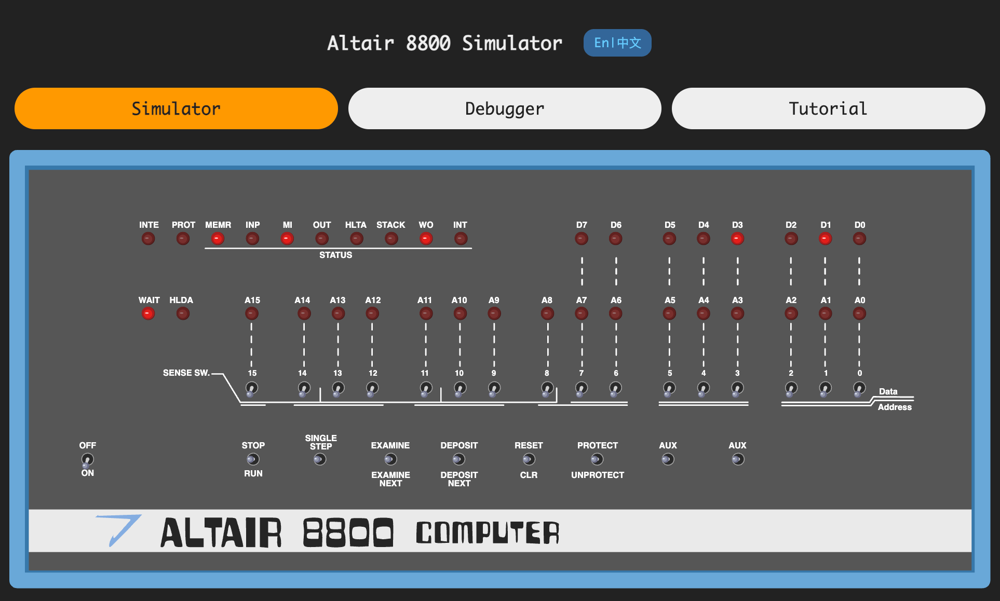
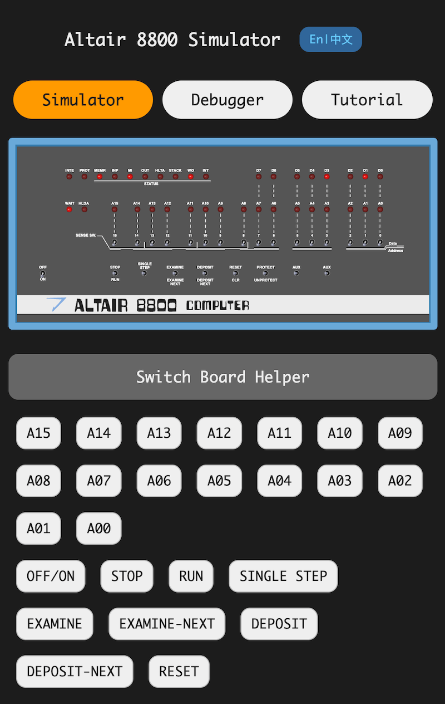

# Altair 8800 simulator.

A JavaScript simulator to demonstrate the front panel operations of Altair 8800.

## Usage

Simply open index.html in browser, or copy the entire dir to your web server's root dir.

The simulator UI supports English and Chinese for now. In a desktop browser, you may use mouse to toggle or click the switches on the panel directly.



There is a Debugger tab where you can check the internal status of the simulated 8080 CPU, or the contents of the simulator's memory.


The simulator works fine with modern mobile browsers, except that it is a bit challenging to touch a single switch on the panel on a mobile screen. Although, the helper switch buttons below the panel can be used as an alternative solution.



## A Quick Tutorial

With a running Altair 8800 simulator, how to input and run the following program to calculate 1 + 2 = 3:

```
        LDA 0080H  ; 00 111 010
                   ; 10 000 000
                   ; 00 000 000
        MOV B,A    ; 01 000 111
        LDA 0081H  ; 00 111 010
                   ; 10 000 001
                   ; 00 000 000
        ADD B      ; 10 000 000
        STA 0082H  ; 00 110 010
                   ; 10 000 010
                   ; 00 000 000
        JMP 0000H  ; 11 000 011
                   ; 00 000 000
                   ; 00 000 000
```

 1. Turn on Altair 8800 by clicking OFF/ON switch.
 1. Set switches A7-A0 to 00 111 010 (up for 1, down for 0).
 1. Click "DEPOSIT".
 1. Set switches A7-A0 to 10 000 000.
 1. Click "DEPOSIT NEXT".
 1. Repeat step 4-5 to input the following bytes one by one: 00 000 000, 01 000 111, 00 111 010, 10 000 001, 00 000 000, 10 000 000, 00 110 010, 10 000 010, 00 000 000, 11 000 011, 00 000 000, 00 000 000.
 1. Set switches A7-A0 to 10 000 000.
 1. Click "EXAMINE".
 1. Set switches A7-A0 to 00 000 001 (the first number to be added, or 1 in decimal).
 1. Click "DEPOSIT".
 1. Set switches A7-A0 to 00 000 010 (the second number to be added, or 2 in decimal).
 1. Click "DEPOSIT NEXT".
 1. Click "RESET".
 1. Click "RUN" and wait for a few seconds.
 1. Click "STOP".
 1. Set switches A7-A0 to 10 000 010 (the address that holds the sum).
 1. Click "EXAMINE".
 1. The LEDs D7-D0 show the result 00 000 011 (3 in decimal).
 1. Turn off Altair 8800.

## References

- [Wikipedia: Altair 8800](https://en.wikipedia.org/wiki/Altair_8800)
- [Wikipedia: Intel 8080 CPU](https://en.wikipedia.org/wiki/Intel_8080)
- [Intel 8080 instruction set](http://www.classiccmp.org/dunfield/r/8080.txt)
- [Original Altair 8800 manuals](https://altairclone.com/altair_manuals.html)
- [Altair 8800 Operator's Manual](https://altairclone.com/downloads/manuals/Altair%208800%20Operator's%20Manual.pdf)
- [Intel 8080 Assembly Language Programming Manual](http://www.classiccmp.org/dunfield/r/8080asm.pdf)
- [Another Altair 8800 simulator](https://s2js.com/altair/)

## Acknowledgements

I use https://github.com/maly/8080js to execute Intel 8080 instruments.

The Quick Tutoral in the simulator UI refers to an example program got from the original [Altair 8800 Operator's Manual](https://altairclone.com/downloads/manuals/Altair%208800%20Operator's%20Manual.pdf).

The interaction design took [another Altair 8800 simulator](https://s2js.com/altair/) as a reference.
